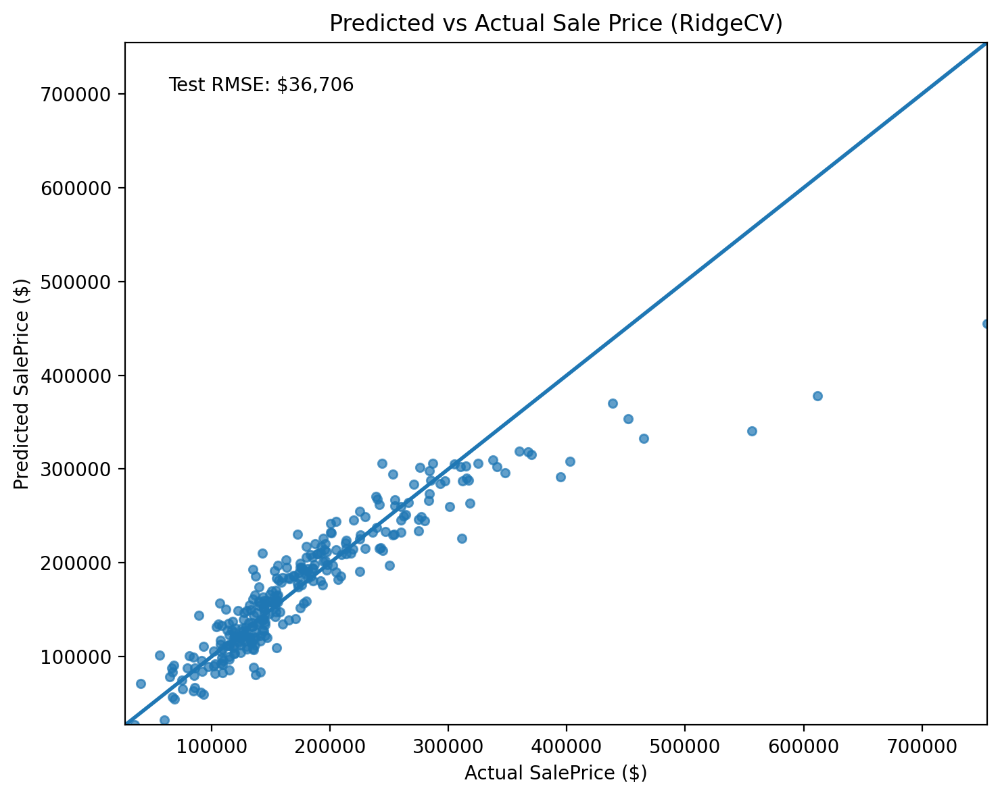
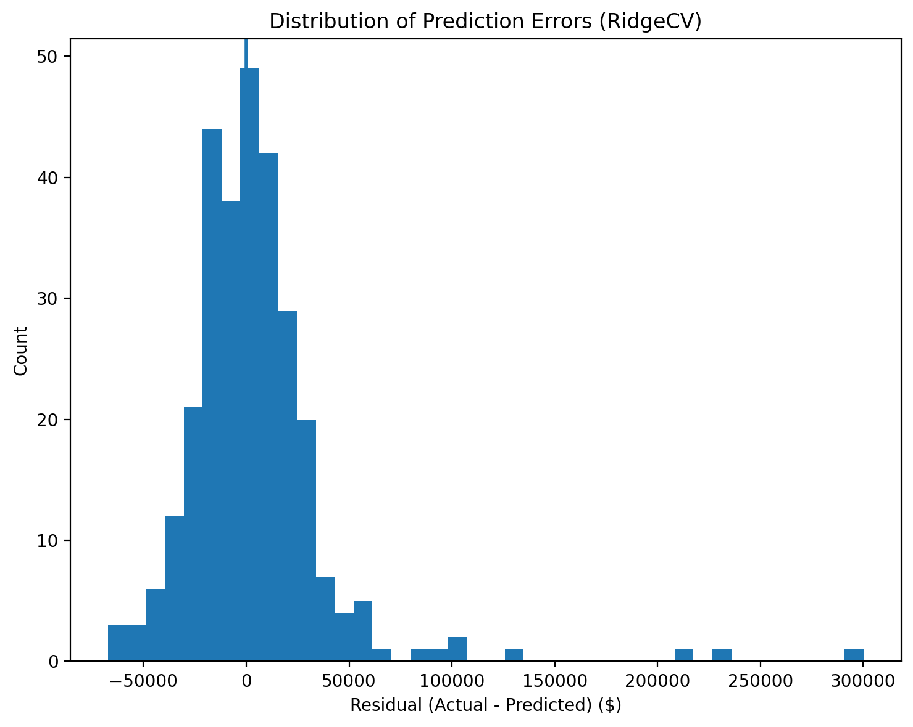
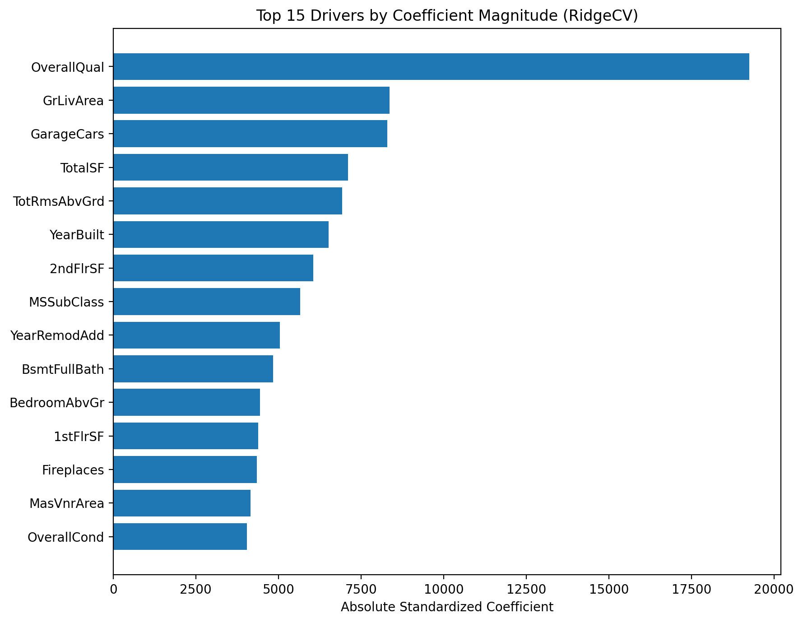
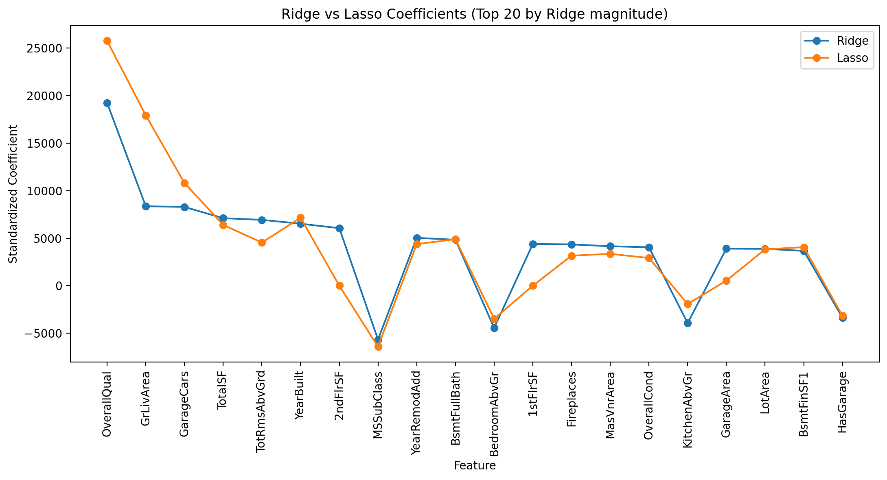

Executive Summary

🏠 Housing Price Prediction (Ames Dataset)

Business Question: What property characteristics most influence housing sale price, and can we build a stable, generalizable pricing model that supports decision-making without overfitting to historical noise? The goal was not only to predict prices, but to understand which factors consistently drive home value.

Dataset: This project uses the Ames Housing dataset (1,460 transactions, 80+ features) to build and evaluate regularized regression models that balance predictive accuracy with interpretability.

🔎 Key Insights

Predicted vs Actual:
The visualization below shows model predictions compared to true sale prices on the held-out test set. Homes cluster closely around the 45° reference line, indicating strong alignment between predicted and actual values.

    
Model Error Analysis:
Prediction errors are largest for high-end homes. Extremely expensive properties are inherently harder to price precisely and contribute disproportionately to total error. No systematic pricing bias was detected. The model does not consistently over- or under-estimate across the test set.

    
Key Drivers of Sales Price:
Overall home quality and square footage are the strongest drivers of price. Larger, higher-quality homes consistently command higher sale prices.

    
Regularization Comparison:
Regularization improves model stability. The dataset contains many correlated structural features (e.g., different measures of size), and regularization ensures predictions remain stable and generalizable. Simpler models perform nearly as well as complex ones. The Lasso model eliminated 15 predictors while maintaining similar accuracy, demonstrating that much of the predictive signal is concentrated in a smaller subset of features.

    
📊 Methodology

Approach
    
    Cleaned and transformed raw housing data into a reproducible modeling dataset
    
    Engineered interpretable features (e.g., total square footage, structural indicators)
    
    Addressed missing values using median imputation
    
    Applied cross-validated Ridge and Lasso regression models
    
    Evaluated performance on a held-out test set (train/test split 80/20)

📈 Model Performance
    
    On unseen test data:
    
        RidgeCV Test RMSE: ~$36,706
    
        LassoCV Test RMSE: ~$36,819
    
    Lasso reduced the feature set from 40 variables to 25 with minimal loss in accuracy
    
    In practical terms, the model typically predicts sale price within approximately $35–40K of the true value.

Results (Test Set)

Model comparison (held-out test set):

Model    Best Alpha    Test RMSE       Non-zero Coefs (Lasso)  Num Features Used

RidgeCV  184.206997    36706.387848                     NaN                 40

LassoCV  1000.000000   36818.597972                    25.0                 40 

Results Interpretation

    Ridge slightly outperformed Lasso in RMSE (Ridge RMSE = 36,706 vs Lasso RMSE = 36,819); Difference = $113. This is extremely small relative to home prices.

        This suggests multicollinearity is present — and Ridge handles it well.

    Lasso reduced the model to 25 non-zero coefficients, demonstrating automatic feature selection. with 15 predictors that were shrunk to exactly zero and achieved similar performance with 37% fewer predictors. 

        The signal is concentrated in a subset of features

    Model Tradeoffs: Performance vs Simplicity

        Ridge = slightly better RMSE, uses all features (shrunken)

        Lasso = nearly identical RMSE, simpler model with only 25 predictors

        if interpretability matters, Lasso is preferred

        if pure prediction matters, Ridge slightly edges out
